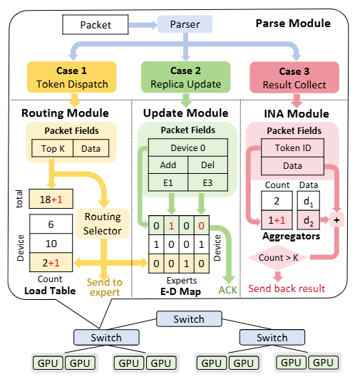

<h1 align="center">
   
  SwitchMoE
   
</h1>

  <a href="#-key-features">Key Features</a> •
  <a href="#-get-started">Get Started</a> •
  <a href="#-license">License</a> •
  <a href="#-links">Links</a>

## 🎯 Key Features

* Support for up to Top-8 (and more) token replica copying and load balancing forwarding.
* Support for $2^{16}$ (and more) experts.
* Currently supports load balancing across 4 ports (devices) (Tofino-2 supports at least 8).

## 🚄 Get Started

### 🕶️ Overview

* **Routing Module:** Replicate the token and perform load balancing forwarding based on the Top-k from the token header.
* **Update Module:** Update the expert's location.
* **INA Module:** Complete token aggregation within the switch.

### ⚙️ Requirements

This repository has hardware and software requirements.

**Hardware Requirements**

* Our testbed evaluation is conducted on the `tofino 1` switch with `bf-sde 9.7.0`.

## 📖 License

The project is released under the MIT License.

## 🔗 Links

Below are some links that may also be helpful to you:

- [P4lang](https://github.com/p4lang/)
- [conweave-p4](https://github.com/conweave-project/conweave-p4)